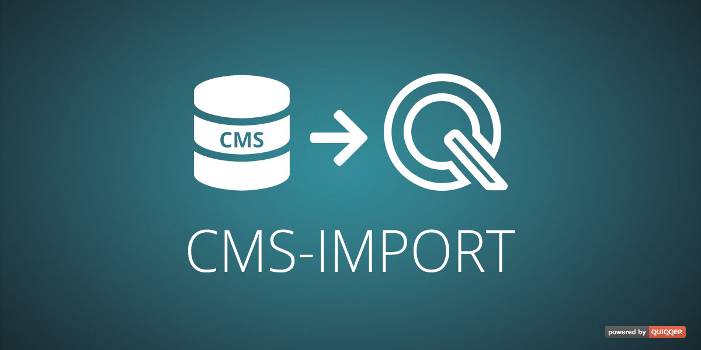

QUIQQER CMS Import
========

Import/migrate data and structure of third party CMS systems to your QUIQQER system.

Package Name:

    quiqqer/cms-import

You are a developer and want to build an ImportProvider for your CMS? See our [wiki](https://dev.quiqqer.com/quiqqer/cms-import/wikis/Developing-a-QUIQQER-CMS-Import-Provider)
on how to create your own ImportProvider.

Features
--------
* Import different areas (your choice) of third party CMS systems to QUIQQER:
  * Sites (QUIQQER Webpages)
  * Tags and tag groups
  * Users
  * Groups
  * Media (folders and files)
  * Translations
  * Permissions
  * System configuration
* Optional cleanup of your QUIQQER system to prepare for a fresh import
* Works in conjunction with special cms-import modules that read data from third party CMS systems 
and provide it for `quiqqer/cms-import`
* Review import items and processes of special interest in the `review.log` after the import is done

Installation
------------
The Package Name is: quiqqer/cms-import

Contribute
----------
- Project: https://dev.quiqqer.com/quiqqer/cms-import
- Issue Tracker: https://dev.quiqqer.com/quiqqer/cms-import/issues
- Source Code: https://dev.quiqqer.com/quiqqer/cms-import/tree/master

Support
-------
If you found any errors or have wishes or suggestions for improvement,
please contact us by email at support@pcsg.de.

We will transfer your message to the responsible developers.

License
-------
GPL-3.0+